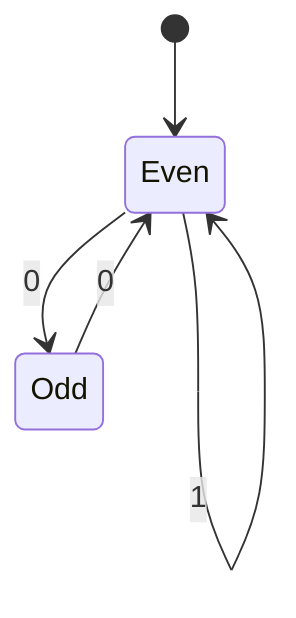

# Irradix

Integer packing through the golden ratio: an experimental codec, an exact Fibonacci implementation, and a study of the even-shift language and its arithmetic.

> **[Read the mathematical paper (PDF)](output/pdf/phi-proof.pdf)**
> The complete even-gap proof, exact addition and multiplication, negative-φ correspondence, and prime/residue consequences.
>
> [TeX source](output/pdf/phi-proof.tex) · [Lean proof](research/lean/PhiPacking.lean) · [Formal verification record](research/lean/README.md)

Irradix repeatedly divides an integer by φ and records a binary digit. In exact arithmetic, this enumerates **every binary word beginning with `1` whose zero runs between successive ones have even length**, exactly once. Trailing zeros are unrestricted. The missing pattern `101` provides a starting point for delimiter-based packing; the stronger language rule connects the implementation to Fibonacci numbers, symbolic dynamics, and negative-base expansions.

The repository contains both the original packing experiments and exact research implementations. Direct Irradix uses about 44% more payload bits than binary. Its practical opportunity is constrained coding and encoding metadata such as integer lengths; its mathematical interest is the explicit connection between integer division and a two-state language.

## Try the exact implementation

From the repository root, with Python 3.8 or later; no third-party dependencies are needed for this example:

```python
from research.phi_exact import fibonacci_irradix, fibonacci_derradix

assert fibonacci_irradix(8) == "1001"
assert fibonacci_derradix("1001") == 8

n = 10**200 + 123
assert fibonacci_derradix(fibonacci_irradix(n)) == n
```

The exact converters support signed integers; zero is represented as `0`. The decoder rejects noncanonical words, including `101` and words with leading zeros. [phi_exact.py](research/phi_exact.py) also provides an independent integer-square-root implementation of the same mapping.

| Integer `n` | Irradix `E(n)` | Ordinary binary value `B(n)` |
| ---: | :--- | ---: |
| 1 | `1` | 1 |
| 2 | `10` | 2 |
| 3 | `11` | 3 |
| 4 | `100` | 4 |
| 5 | `110` | 6 |
| 6 | `111` | 7 |
| 7 | `1000` | 8 |
| 8 | `1001` | 9 |

## What the encoding means

For a positive integer, the exact step is

$$
q=\left\lfloor n/\varphi\right\rfloor,\qquad
 d=n-\left\lceil\varphi q\right\rceil\in\{0,1\},\qquad
 E(n)=E(q)d,
$$

using an empty word for `E(0)` during recursion. Decode from left to right by replacing the current prefix value `q` with `ceil(φq) + d` for each digit.

This is an iterated ceiling construction. Evaluating its digits as powers of φ does not generally recover the input: `E(2)=10`, whereas the positional value of `10` in base φ is φ.

### Why φ produces even zero gaps

Set `a=φ−1`, `c=2−φ`, and let the phase of a positive prefix `q` be `t=frac(φq)`. A following `1` is admissible exactly when `t>c`. Appending `0` gives

$$
t_{\mathrm{new}}-c=-a(t-c).
$$

A `1` leaves the phase above `c`; every subsequent zero flips its side. Another `1` is therefore allowed after exactly an even number of zeros. This proves the full characterization, including its converse—not merely the absence of `101`.

After the leading `1`, the graph is:



Both states may terminate a word. Equivalently, the canonical positive language is `1(1|00)*(ε|0)`. Leading-zero versions belong to the broader even-shift language but are not additional canonical integer representations. The original packer's transformed inputs select a subset of these words.

### Fibonacci counts and faster conversion

With `F₀=0`, `F₁=1`, there are `Fₖ₊₁` words of length `k`, representing precisely

$$
F_{k+2}-1\le n\le F_{k+3}-2.
$$

For a valid word `1 dₖ₋₂ … d₀`,

$$
n=F_{k+2}-1+\sum_{j=0}^{k-2}d_jF_{j+1}.
$$

This yields exact ranking and unranking using integer additions, comparisons, and subtractions. It also explains the asymptotic length `log₂(n)/log₂(φ) ≈ 1.44042 log₂(n)`. In the [recorded local benchmark](research/phi_measurements.json), encoding 100 random 256-bit integers took about 0.493 s in the original Python implementation and 0.0077 s with Fibonacci ranking. These timings are workload and machine dependent.

## The deeper connection: negative φ

The graph's adjacency matrix has eigenvalues `φ` and `ψ=−1/φ`. The first controls the number of words; the second is the contraction and reflection in the phase proof.

There is also an exact positional correspondence. For `n≥1`, define `x(n)=2−φ−frac(φn)`. Its greedy fractional expansion in base `−φ` is

```text
. reverse(E(n)) 1 000000...     (base −φ)
```

The extra terminal `1` handles the boundary of the negative-base interval. Expanding this identity in the basis `1, φ` recovers the Fibonacci decoder above. The [detailed derivation](research/NEGATIVE_PHI_CONNECTION.md) includes the boundary case and exact checks using integer pairs, with no floating-point arithmetic.

The general negative-φ/even-shift connection was already explicit in **Frougny and Lai (2009)**, Examples 2–3 [2]. Irradix's particular quotient map is related to that construction by the identity above; this repository does not claim to originate the language or the general connection.

## Primes: exact restrictions and an experimental heuristic

Here “mapped prime” means that `B(n)`, the Irradix word interpreted in ordinary binary, is prime. It does not mean the input `n` is prime.

If a word has length `k` and `t` trailing zeros, the even-gap condition implies

$$
B(n)\equiv
\begin{cases}
0 & k-t\text{ even},\\
(-1)^t & k-t\text{ odd}
\end{cases}\pmod 3.
$$

Successive one-bit exponents alternate parity, so their contributions modulo 3 cancel in pairs. Consequently:

- **Every mapped prime above 3 has odd binary length and is `1 mod 6`.**
- **Every even-length block with `k≥4` is composite.** For example, all inputs `986..1595` map to composite numbers.
- The proportion of inputs mapping to numbers coprime to 6 has no limit: at complete length-block endpoints it tends to `φ⁻³≈23.61%` along odd lengths and `φ⁻⁴≈14.59%` along even lengths.
- For each fixed modulus coprime to 6, binary residues become uniformly distributed among length-`k` words as `k` grows. A proof uses the graph combined with a residue tracker and Perron–Frobenius theory.

These are mathematical consequences of the language. A separate **heuristic** applies the density `3/log B` to eligible images `B>3` congruent to 1 modulo 6, adding the exceptions 2 and 3:

| Inputs `1..N` | Exact mapped primes | Modulo-6 logarithmic heuristic |
| ---: | ---: | ---: |
| 100 | 12 | 14.32 |
| 1,000 | 94 | 94.46 |
| 10,000 | 466 | 464.53 |
| 100,000 | 4,319 | 4,342.72 |

The factor 3 is not fitted. These are nested samples, and agreement is not a prime-distribution proof. Fixed-modulus uniformity does not supply the growing-modulus estimates needed for such a proof. We establish neither infinitely many mapped primes nor a prime-counting asymptotic. Maynard's work on restricted decimal digits [8] is relevant background, with different hypotheses.

[Proofs and research questions](research/NEGATIVE_PHI_CONNECTION.md) · [Reproducible residue and prime measurements](research/residue_measurements.json)

## Arithmetic directly on the digits

[phi_arithmetic.py](research/phi_arithmetic.py) implements exact signed addition,
multiplication, increment, and decrement without decoding whole integer values:

```python
from research.phi_arithmetic import add, increment, decrement, multiply, is_sum

assert increment("1001") == "1100"       # 8 + 1 = 9
assert decrement("1000") == "111"        # 7 - 1 = 6
assert add("110", "1001") == "10010"     # 5 + 8 = 13
assert add("-1001", "110") == "-11"      # -8 + 5 = -3
assert multiply("110", "1001") == "1001111"  # 5 * 8 = 40
assert is_sum("110", "1001", "10010")
```

Prefixing a codeword with one extra `1` gives Fibonacci weight `n+1`.
The adder uses that identity and a **19-state carry machine**, combined
with the output-language automaton. It performs linear digit work, with
at most five active candidate states per column. An independent weight
oracle checked a 100,000-digit sum. The incrementer follows the next word
in language order and is simpler still. Multiplication uses the adder in
a Fibonacci-weight version of shift-and-add, with quadratic digit work
for equally sized operands. It also handles signed values.

The multiplier is substantially slower than decode/multiply/re-encode
on the recorded samples. The adder constructs its output by retaining
paths and tracing back at the end; it is not an online emitter. In fact, even canonical incrementing
cannot emit digits with bounded delay in either direction. The generic
adder remains slower than decode/add/re-encode in the recorded smaller
benchmarks; the direct incrementer is faster on those samples.

[Arithmetic proofs, streaming limitation, and API](research/ARITHMETIC.md) ·
[Addition measurements](research/arithmetic_measurements.json) ·
[Multiplication measurements](research/multiplication_measurements.json) ·
[Lean carry invariant](research/lean/PhiArithmetic.lean)

Finite-state Fibonacci arithmetic has established prior art [9, 10].
This construction handles Irradix's particular representation. It supplies
no cryptographic trapdoor: decoding still exposes the underlying integer.

## Packing and practical tradeoffs

The original [irradix.py](irradix.py) offers single-value conversion, direct byte packing (`encode`/`decode`), and length-first packing (`l1encode`/`l1decode`). Packed inputs are nonnegative integers. Install its dependencies with `python3 -m pip install -r requirements.txt`.

```python
from irradix import encode, decode, l1encode, l1decode

values = [0, 1, 8, 1000]
assert decode(encode(values)) == values
assert l1decode(l1encode(values)) == values
```

Direct packing transforms inputs and repairs delimiter boundaries. A forbidden substring inside individual words does not alone guarantee safe concatenation: occurrences can cross a boundary. The research module includes a separately specified guarded bitstring format, `E(n+1) + 00 + 101`; it is experimental and incompatible with the original byte format.

Length-first packing stores ordinary binary payloads and encodes their lengths, giving a `B + O(log B)` cost for a `B`-bit integer. On the seeded sample of 1,000 integers with 50–100 decimal digits:

| Method | Stored bits, including byte rounding where applicable |
| :--- | ---: |
| Raw payload only, without framing | 248,161 |
| Direct Irradix | 361,216 |
| Length-first Irradix | 264,240 |
| Elias delta applied to `n+1` | 263,072 |
| VByte | 286,984 |

This demonstrates a length-first advantage over VByte on that sample, while Elias delta is slightly smaller. It does not establish general compression superiority. Fibonacci and Elias codes are established comparison points [5, 6]. The repository's VByte implementation is not Stream VByte [7].

The original Python converter uses fixed `mpmath` precision, and the C++ version uses floating-point arithmetic. They should not be treated as exact arbitrary-size converters: the recorded Python checks find failures near `10**100` at 100 decimal digits of precision. Use the exact research converters for the mathematical mapping. Existing `olencode`/`oldecode` functions are batch wrappers, not incremental streaming implementations.

[Optimization analysis and framing details](research/PHI_ANALYSIS.md)

## Reproduce and verify

Run from the repository root:

```sh
python3 research/analyze_phi.py
python3 research/check_negative_phi.py
python3 research/analyze_residues.py
python3 research/check_arithmetic.py
python3 research/check_multiplication.py
# Optional comparison with the original code; requires requirements.txt:
python3 research/analyze_phi.py --legacy
```

The core run compares 100,001 encodings across independent exact algorithms, checks 500 Fibonacci length thresholds, and exercises experimental codecs. The new checks cover 10,000 exact negative-base expansions, 100,000 modular identities, residue counts through length 100, and a prime sieve for 100,000 inputs. Recorded outputs are [phi_measurements.json](research/phi_measurements.json) and [residue_measurements.json](research/residue_measurements.json).

| Result | Verification status |
| :--- | :--- |
| Exact quotient/ceiling model; complete even-gap language; exclusion of `101` | Compiled Lean proof, pinned toolchain; no `sorry` |
| Fibonacci formulas; negative-φ identity; residue theorems | Written proofs, supplemented by exact Python checks |
| Arithmetic carry/acceptance equations and scaled multiplication invariant under augmented-weight hypotheses | Compiled Lean proof; finite bounds and implementation have written proofs and executable checks |
| Packing implementations and size/timing measurements | Executable checks and experiments; not formally verified |
| Prime-density formula | Heuristic, compared with exact sieve counts |

See [Lean build instructions and theorem inventory](research/lean/README.md). The [TeX source](output/pdf/phi-proof.tex) builds with `pdflatex`; the PDF is checked into the repository. [paper.md](paper.md), [results.md](results.md), and [data/table.txt](data/table.txt) preserve historical experiments; this README and the research paper supersede their broader interpretations.

## What is worth pursuing next?

Addition, multiplication, increment, and decrement are now implemented. The next engineering targets are reducing the adder’s table and path-storage overhead and comparing specialized multipass implementations. Canonical bounded-delay streaming in either direction is ruled out by the incrementer counterexamples. Quantitative residue estimates as the modulus grows remain a more difficult mathematical target toward understanding primes.

Generalizing by merely replacing φ with another graph's growth rate does not work. For the graph allowing zero gaps divisible by 3, its growth rate satisfies `β³=β²+1`, yet repeated quotient encoding gives `Eβ(4)=101`. The [research note](research/NEGATIVE_PHI_CONNECTION.md) proves this counterexample and the limited uniqueness statement that φ is the only quadratic Pisot number between 1 and 2.

## Origins and references

The maintainer dates Irradix's original development to approximately 2018. The even-shift language predates that work, and its negative-φ realization was published in 2009. The contribution documented here is an explicit analysis of this repository's integer construction, its exact implementation, and its consequences; priority for the particular construction has not been established.

1. **Douglas Lind and Brian Marcus.** *An Introduction to Symbolic Dynamics and Coding.* Cambridge University Press, 1995. [Authors' book site](https://sites.math.washington.edu/SymbolicDynamics/). Background on shifts, graph presentations, entropy, and coding.
2. **Christiane Frougny and Anna Chiara Lai.** *On Negative Bases.* DLT 2009, LNCS 5583, pp. 252–263. [Paper](https://www.irif.fr/~cf/publications/dlt-final.pdf) · [DOI](https://doi.org/10.1007/978-3-642-02737-6_20). The negative-φ/even-shift example and finite-transducer normalization for negative Pisot bases.
3. **Marcus Pivato and Reem Yassawi.** *Asymptotic Randomization of Sofic Shifts by Linear Cellular Automata.* Preprint, 2003; revised 2006. [arXiv](https://arxiv.org/abs/math/0306136). An explicit pre-2018 treatment of the even shift; their symbol convention can be exchanged with ours.
4. **Daniel Glasscock, Joel Moreira, and Florian K. Richter.** *Additive and geometric transversality of fractal sets in the integers.* Journal of the London Mathematical Society, 2024. [DOI](https://doi.org/10.1112/jlms.12902). Section 3.3 treats the even shift as a binary integer set of dimension `log φ/log 2`; this is a later application, not the language's origin.
5. **Alberto Apostolico and Aviezri S. Fraenkel.** *Robust Transmission of Unbounded Strings Using Fibonacci Representations.* Purdue technical report 85-545, 1985; journal version, IEEE Transactions on Information Theory, 1987. [Report](https://docs.lib.purdue.edu/cstech/464/). Established Fibonacci coding for comparison with Irradix framing.
6. **Debra A. Lelewer and Daniel S. Hirschberg.** *Data Compression.* [Authors' survey, section 3](https://ics.uci.edu/~dhirschb/pubs/DC-Sec3.html). Universal integer codes and the Elias/Fibonacci baselines.
7. **Daniel Lemire, Nathan Kurz, and Christoph Rupp.** *Stream VByte: Faster Byte-Oriented Integer Compression.* Preprint, 2017. [arXiv](https://arxiv.org/abs/1709.08990). Context for fast byte-oriented codecs, distinct from this repository's VByte baseline.
8. **James Maynard.** *Primes with restricted digits.* Preprint, 2016. [arXiv](https://arxiv.org/abs/1604.01041). A prime theorem for a different digital restriction; it is not a theorem about Irradix.
9. **Christiane Frougny.** *On-line finite automata for addition in some numeration systems.* RAIRO–Theoretical Informatics and Applications 33(1), 79–101, 1999. [Paper](https://www.numdam.org/item/ITA_1999__33_1_79_0.pdf). Online addition for golden-ratio and Fibonacci representations, with different canonical conventions.
10. **Connor Ahlbach, Jeremy Usatine, Christiane Frougny, and Nicholas Pippenger.** *Efficient Algorithms for Zeckendorf Arithmetic.* Fibonacci Quarterly 51(3), 249–255, 2013. [Paper](https://www.fq.math.ca/Papers1/51-3/AhlbachUsatineFrougnyPippenger.pdf). Linear-time, three-pass addition in Zeckendorf representation.
